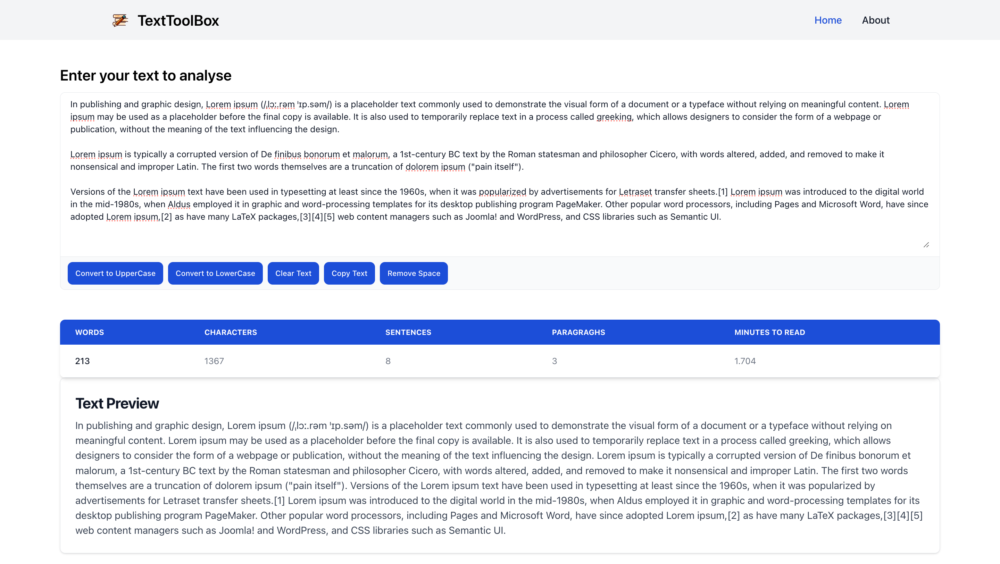

# TextToolbox

**TextToolBox** is a versatile utility designed to help you manipulate text in various ways, offering a range of features to suit your text editing needs. With TextToolBox, you can effortlessly:

- **Convert Text to Uppercase**: Transform all your text to uppercase letters with a single click, making it perfect for headings or emphasizing certain sections.
- **Convert Text to Lowercase**: Easily change your text to lowercase, ideal for creating uniform text formats.
- **Clear Text**: Quickly clear all the text in your input field, giving you a fresh start for new content.
- **Copy Text**: Copy your text to the clipboard effortlessly, allowing you to paste it wherever you need it.
- **Remove Extra Spaces**: Clean up your text by removing unnecessary spaces, ensuring a neat and tidy output.
- **Count Words**: Get an accurate word count for your text, useful for meeting word limits in documents or articles.
- **Count Characters**: Keep track of the number of characters in your text, essential for writing within character limits.
- **Count Sentences**: Easily count the number of sentences, helping you analyze the structure and readability of your text.
- **Count Paragraphs**: Determine the number of paragraphs in your text, useful for organizing your writing.
- **Estimate Reading Time**: Get an estimated reading time for your text, helping you gauge how long it will take readers to go through your content.
- **Preview Text**: See a live preview of your formatted text, allowing you to make adjustments as needed.

### TextToolbox Preview

